# Visual-Inertial Odometry

Two-phase writeup: Phase 1 implements a classical filter-based VIO
(Stereo MSCKF), Phase 2 will append a learning-based / hybrid approach to
the same document as it progresses.

- [Phase 1: Classical VIO](#phase-1-classical-vio) — S-MSCKF, EuRoC Machine Hall.

---

# Phase 1: Classical VIO

Python implementation of the Stereo Multi-State Constraint Kalman Filter
(S-MSCKF) for WPI RBE/CS549 P4. Seven functions in `Code/Phase 1/msckf.py` were
implemented from scratch following the two reference papers and the authors'
C++ implementation; everything else (feature tracking, triangulation,
viewer) ships with the starter code. A per-sequence analysis of MH_01_easy
and the outlier sequences lives at
[`Code/Phase 1/analysis.md`](Code/Phase%201/analysis.md).

## References

| short-name | full citation | file |
|---|---|---|
| **S-MSCKF** | Sun et al., *Robust Stereo Visual Inertial Odometry for Fast Autonomous Flight*, RA-L 2018 | `1712.00036v3.pdf` |
| **MSCKF'07** | Mourikis & Roumeliotis, *A Multi-State Constraint Kalman Filter for Vision-aided Inertial Navigation*, ICRA 2007 | `ICRA07-MSCKF.pdf` |
| **C++ ref** | `KumarRobotics/msckf_vio` | `msckf_vio-master/src/msckf_vio.cpp` |

Conventions: JPL quaternion `[x, y, z, w]`, `imu_state.orientation` rotates
world→IMU, gravity in world frame is `[0, 0, −g]`.

## Implemented functions

All seven stubs in `Code/Phase 1/msckf.py` are implemented and cross-checked
against both papers. Line numbers below refer to the Python port.

### 1. `initialize_gravity_and_bias` — msckf.py:231

Uses the buffer collected during the static warm-up period to estimate the
initial gyro bias and gravity magnitude, then aligns the IMU frame to world.

- `b_g = mean(ω)` over the buffer.
- `|g| = ‖mean(a)‖` — measured gravity from the static accel readings.
- World-frame gravity set to `[0, 0, −|g|]` (`IMUState.gravity`).
- Initial orientation: `q` such that `to_rotation(q) @ (−gravity_world) = mean(a)` via `from_two_vectors`.

Paper refs: S-MSCKF §III-A (p. 2) describes the static-initialisation
assumption. MSCKF'07 does not specify this explicitly — the approach follows
the C++ reference (`msckf_vio.cpp:248–284`).

### 2. `batch_imu_processing` — msckf.py:262

Consumes buffered IMU messages up to the current image timestamp: for each
message it calls `process_model`, assigns `imu_state.id = IMUState.next_id`
**before** incrementing (matches the C++ post-increment at `msckf_vio.cpp:538`),
then slices the buffer.

Paper refs: conceptually §III-A of S-MSCKF (propagation between image frames).

### 3. `process_model` — msckf.py:285

Builds the 21×21 continuous-time error-state Jacobian `F` and the 21×12
noise Jacobian `G`, discretises to `Φ` by a 3rd-order Taylor expansion of
`expm(F·dt)`, propagates the nominal state via `predict_new_state`, applies
the Observability-Constrained EKF (OC-EKF) correction to Φ, and updates the
covariance.

Non-zero blocks of `F` (rows = `[δθ, δb_g, δv, δb_a, δp, δθ_ext, δp_ext]`):

| block | expression | source |
|---|---|---|
| `F[0:3, 0:3]` | `−skew(ω̂)` | S-MSCKF Appendix A, p. 7 |
| `F[0:3, 3:6]` | `−I₃` | S-MSCKF Appendix A |
| `F[6:9, 0:3]` | `−Rᵀ · skew(â)` | S-MSCKF Appendix A |
| `F[6:9, 9:12]`| `−Rᵀ` | S-MSCKF Appendix A |
| `F[12:15, 6:9]`| `I₃` | S-MSCKF Appendix A (`ṗ = v`) |

`G` has four 3×3 blocks of `−I` / `I` mapping `[n_g, n_wg, n_a, n_wa]` into
the IMU error state, mirroring `msckf_vio.cpp:540–628`.

Discrete transition: `Φ = I + F·dt + 0.5·(F·dt)² + (1/6)·(F·dt)³` (matches
MSCKF'07 p. 3 and the C++ expansion).

**OC-EKF** (S-MSCKF §III-C, p. 4; Hesch et al.): after propagating, we
rewrite three columns of Φ so that the filter preserves the unobservable
yaw/translation directions. Using `orientation_null / velocity_null /
position_null` captured at the previous step:

- Φ[0:3, 0:3] ← recomputed so it maps `gravity_null` onto itself.
- Φ[6:9, 0:3] ← `A − (A·u − w)·uᵀ / (uᵀu)` with `u = R(q_null)·g_world`,
  `w = skew(v − v_null)·g_world`, `A = Φ[6:9, 0:3]`.
- Φ[12:15, 0:3] ← same recipe with `w = skew(dt·v_null + p − p_null)·g_world`.

After the update, `orientation_null / velocity_null / position_null` are
refreshed to the post-propagation state — required so the next step's
re-projection uses the correct linearization point.

Covariance: `P_II ← Φ P_II Φᵀ + Q_d`, and the IMU–camera cross-terms
`P_IC ← Φ P_IC`. The result is symmetrised with `0.5·(P + Pᵀ)`.

### 4. `predict_new_state` — msckf.py:356

4th-order Runge–Kutta integration of the nominal IMU state over `dt`.

- Quaternion: closed-form solution of `q̇ = ½Ω(ω)·q` via
  `dq_dt = cos(|ω|·dt/2)·I + sin(|ω|·dt/2)/|ω|·Ω(ω)` applied to the current
  quaternion (S-MSCKF Eq. (1), p. 3; MSCKF'07 Eq. (6)). We also compute
  `dq_dt2` at `dt/2` for the mid-step.
- Velocity / position: standard RK4 with `v̇ = Rᵀ·â + g_w`, `ṗ = v`.

All rotations are computed using `quaternion_normalize` of the interpolated
quaternions — keeps RK4 from drifting off the unit sphere.

### 5. `state_augmentation` — msckf.py:411

On every image, a fresh camera state is inserted into the
ordered-dict `cam_states` and the covariance is grown by one 6-dim block.

- Camera pose: `R_w_c = R_i_c · R_w_i`,  `t_c_w = p_imu + R_w_i ᵀ · t_c_i`.
- Jacobian `J` (6×21), following S-MSCKF Appendix B (p. 7) and MSCKF'07
  Eq. (14)–(16), non-zero blocks:
  - `J[0:3, 0:3] = R_i_c`
  - `J[0:3, 15:18] = I₃`
  - `J[3:6, 0:3] = skew(R_w_i ᵀ · t_c_i)`
  - `J[3:6, 12:15] = I₃`
  - `J[3:6, 18:21] = R_w_i ᵀ`
- Augmented covariance, matching `msckf_vio.cpp:695–755`:

  ```
  P_new = [ P        (J P_II ↦ P_IC)ᵀ
            J P_II   J P_II Jᵀ ]
  ```

**Known paper-vs-C++ discrepancy**: S-MSCKF Appendix B's erratum gives
`J[3:6, 0:3] = −Rᵀ · skew(t_c_i)`, but the reference C++ keeps the original
MSCKF'07 form `skew(Rᵀ · t_c_i)` with the corrected form commented out
(`msckf_vio.cpp:726`). The Python port follows the C++ for bit-for-bit parity.

### 6. `add_feature_observations` — msckf.py:456

For each `FeatureMeasurement` in the incoming frame, stash its stereo obs
`[u0, v0, u1, v1]` under the feature id. Computes a tracking-rate metric
(`already-tracked / total`) that the filter uses to decide when the motion
is too degenerate to update.

### 7. `measurement_update` — msckf.py:588

Runs the stacked measurement update after feature marginalisation.

1. **Thin QR**: `H = Q·R₁` (reduced mode) — only used when `H` is tall.
   Projects `r` and reduces work from `O(m³)` to `O(n³)` (S-MSCKF §III-B;
   MSCKF'07 Eq. (28)).
2. **Kalman gain**: `K = P·Hᵀ·(H·P·Hᵀ + σ²I)⁻¹`, computed via `np.linalg.solve`
   on `(H·P·Hᵀ + σ²I)·Kᵀ = H·P`.
3. **State update** `δx = K·r`:
   - IMU: `q_new = small_angle(δθ) ⊗ q_old`; bias/velocity/position add;
     extrinsics get the same quaternion+translation update.
   - Cameras: iterate `cam_states.values()` in insertion order — slice
     `δx[21+6i : 21+6(i+1)]` per camera. Order is load-bearing because the
     covariance blocks are keyed by insertion position.
4. **Covariance**: `P ← (I − K·H)·P`, then symmetrised. This is the simple
   form used by the reference C++ (not the Joseph form).

## Code layout

```
Code/
└── Phase 1/            active code — run everything from this directory
    ├── msckf.py
    ├── utils.py, config.py, dataset.py, image.py, feature.py
    ├── vio.py, run_eval.py, evaluate.py, run_all.py
    ├── plot_errors.py, make_video.py
    ├── viewer_mpl.py
    ├── README.md       (original starter README, kept for reference)
    ├── analysis.md     (per-sequence error discussion — see link above)
    ├── imgs/           (sample trajectory image shipped with starter)
    ├── test/           (unit tests for utils.py and the triangulator)
    └── Misc/           archived / redundant — not used at runtime
        ├── msckf_an.py (partial reference with 2 bugs; never imported)
        └── viewer.py   (pangolin viewer — superseded by viewer_mpl.py)
```

### What each file in `Phase 1/` does

| File | Role |
|---|---|
| `msckf.py`      | **The filter.** All 7 stubs (see above) implemented here. |
| `utils.py`      | JPL quaternion helpers (`to_rotation`, `to_quaternion`, `skew`, `small_angle_quaternion`, `Isometry3d`). |
| `config.py`     | `ConfigEuRoC` — noise priors, gating thresholds, filter limits. |
| `dataset.py`    | `EuRoCDataset`, `DataPublisher`, and the IMU/image iterators. `set_starttime(offset)` fast-forwards to a static window for gravity init. |
| `image.py`      | Stereo feature frontend: KLT tracking, stereo matching, `stareo_callback` (given, not modified). |
| `feature.py`    | `Feature` class, lazy triangulation / linear + Gauss-Newton refinement (given). |
| `viewer_mpl.py` | **Live 2-panel OpenCV viewer.** Left: top-down XY with GT (pink) and estimate (black) + 1 m scale bar. Right: live `cam0` frame. Used by `vio.py --view`. |
| `vio.py`        | **Live runner.** Wires the threads (`process_imu`, `process_img`, `process_feature`) and instantiates the viewer when `--view` is passed. Tries pangolin's `viewer` first and falls back to `viewer_mpl` (we always land on the fallback — pangolin isn't installed). |
| `run_eval.py`   | **Headless runner.** Executes the filter and dumps the estimated body-in-world trajectory to CSV (`timestamp,tx,ty,tz,qx,qy,qz,qw`). |
| `evaluate.py`   | Loads est + GT CSVs, nearest-timestamp association, Umeyama SE(3) alignment, computes ATE RMSE / mean / median / max. Can optionally save a 2-panel trajectory PNG. |
| `run_all.py`    | **Batch orchestrator.** Loops over every extracted Machine Hall sequence, calls `run_eval.run(...)` then `evaluate.evaluate(...)`, writes `Results/Phase1/summary.json`. |
| `plot_errors.py`| **Generates Figs 1–6 (rpg_trajectory_evaluation-style):** translation error (x/y/z mm vs distance), rotation error (yaw/pitch/roll deg), relative translation and yaw boxplots at 10/20/30/40/50% sub-trajectory lengths, side view, top view. |
| `make_video.py` | **Offline MP4 renderer.** Reads an est CSV + GT CSV, aligns, and writes `Output.mp4` directly via `cv2.VideoWriter` (codec `mp4v`). No screen recording — see below. |
| `test/utils_test.py`, `test/feature_initialization_test.py` | Unit tests for `utils.py` and the triangulator. |
| `imgs/`         | Sample trajectory image included with the original starter. |

### What's in `Misc/` and why it's not used

- **`msckf_an.py`** — a partial reference implementation we received alongside the starter code. Covers 5 of the 7 stubs (`initialize_gravity_and_bias`, `batch_imu_processing`, `process_model`, `predict_new_state`, `state_augmentation`), leaving `add_feature_observations` and `measurement_update` as `...` stubs. We cross-checked it against the authors' C++ and found two substantive bugs in `process_model` (wrong `.T` on `R_kk_1` and flipped sign on `w1`/`w2`), a crash-inducing shape error in `predict_new_state` (treats a 4-vector quaternion as a rotation matrix in `dR @ acc`), and an initialization bug (`acc_bias` set to the mean specific force, which cancels gravity). Kept only as an archival reference — nothing in the active pipeline imports it.
- **`viewer.py`** — the original pangolin-based 3D viewer shipped with the starter. `viewer_mpl.py` replaces it with a 2-window OpenCV viewer that overlays ground truth in the same window. Pangolin isn't installed on this machine, so `vio.py`'s `try/except` always lands on `viewer_mpl`. Moved here since it's a duplicate of functionality already provided by `viewer_mpl.py`.

### Does `make_video.py` save the video or set up a screen to record?

It **saves the video directly.** Internally it:

1. Loads the est and GT CSVs, associates timestamps, computes Umeyama SE(3) alignment.
2. Builds a 3-panel matplotlib figure (top-down trajectory, altitude, per-sample error).
3. Opens `cv2.VideoWriter(..., fourcc='mp4v', fps, (W, H))` and, for each of `--frames` sampled animation steps, rasterizes the figure with `fig.canvas.buffer_rgba()` and writes the BGR frame.
4. Releases the writer and closes the figure.

No screen, no window, no recording software. Run it and the MP4 appears at `--out`. If you want a video of the *live* OpenCV viewer instead (the one with the cam0 panel), that's a screen-capture job — see the viewer section below.

## How to run

### 1. Run the filter on one sequence

```
cd "Code/Phase 1"
python3 vio.py --path /path/to/MH_01_easy              # headless
python3 vio.py --view --path /path/to/MH_01_easy       # with viewer
```

### 2. Dump an estimated trajectory CSV (for evaluation / plotting)

```
cd "Code/Phase 1"
python3 run_eval.py \
    --path /path/to/MH_01_easy \
    --out  ../../Results/Phase1/MH_01_easy_est.csv \
    --offset 40 --ratio 1.0
```

`--offset` seconds are skipped so the first IMU buffer is static (needed by
`initialize_gravity_and_bias`). `--ratio` < 1 slows playback.

### 3. Compute ATE RMSE + save a trajectory plot

```
python3 evaluate.py \
    --est ../../Results/Phase1/MH_01_easy_est.csv \
    --gt  ../Data/machine_hall/MH_01_easy/MH_01_easy/mav0/state_groundtruth_estimate0/data.csv \
    --plot ../../Results/Phase1/MH_01_easy_traj.png \
    --title MH_01_easy
```

### 4. Run everything end-to-end

```
cd "Code/Phase 1" && python3 run_all.py
```

Loops over all 5 Machine Hall sequences, writes `Results/Phase1/*_est.csv`,
`Results/Phase1/*_traj.png`, and `Results/Phase1/summary.json`.

### 5. Generate the 6 trajectory-error plots (Figs 1–6)

```
python3 plot_errors.py \
    --est ../../Results/Phase1/MH_01_easy_est.csv \
    --gt  ../Data/machine_hall/MH_01_easy/MH_01_easy/mav0/state_groundtruth_estimate0/data.csv \
    --out-dir ../../Results/Phase1/MH_01_easy_plots \
    --title MH_01_easy
```

Produces `fig1_trans_error.png`, `fig2_rot_error.png`, `fig3_rel_trans_error.png`,
`fig4_rel_yaw_error.png`, `fig5_traj_side.png`, `fig6_traj_top.png`. See
[Error plots](#error-plots) below.

### 6. Render `Output.mp4`

```
python3 make_video.py \
    --est ../../Results/Phase1/MH_01_easy_est.csv \
    --gt  ../Data/machine_hall/MH_01_easy/MH_01_easy/mav0/state_groundtruth_estimate0/data.csv \
    --out ../Output.mp4 \
    --title MH_01_easy --fps 30 --frames 240
```

## Results

### ATE (SE(3)-aligned) against Vicon ground truth

Absolute Trajectory Error after Umeyama SE(3) alignment, no scale correction.
Timestamps are nearest-neighbour-associated between estimate and GT with a
20 ms tolerance. Numbers in metres.

| Sequence          |  RMSE |  mean | median |   max | poses | offset (s) |
|-------------------|------:|------:|-------:|------:|------:|-----------:|
| MH_01_easy        | 0.083 | 0.078 |  0.076 | 0.180 |  2841 |         40 |
| MH_02_easy        | 0.377 | 0.317 |  0.274 | 1.117 |  2798 |         10 |
| MH_03_medium      | 0.173 | 0.159 |  0.147 | 0.337 |  2459 |         10 |
| MH_04_difficult   | 0.898 | 0.711 |  0.514 | 2.544 |  1976 |          0 |
| MH_05_difficult   | 0.916 | 0.739 |  0.530 | 2.530 |  2222 |          0 |

Results are in the expected range for a Python S-MSCKF port: sub-10 cm on
MH_01 (long static taxi, slow motion), ~15–40 cm on the mid sequences, and
~0.9 m on the difficult flights where takeoff starts without a long static
window and aggressive motion stresses the linearisation assumptions. See
[`Code/Phase 1/analysis.md`](Code/Phase%201/analysis.md) for a per-sequence
breakdown of where the errors come from.

### Comparison with the S-MSCKF paper

Sun et al. 2017 does **not** publish a numeric table for the EuRoC Machine
Hall sequences — they report RMSE as bar heights in Fig. 2(a) of the paper,
and only for MH_01, MH_04, MH_05 (no MH_02 / MH_03; the V1/V2 bars are Vicon
room sequences that we do not run). The paper numbers below are eyeballed
from that figure (y-axis in metres, ±~0.03 m reading error).

| Sequence           | Ours RMSE (m) | Paper RMSE (m, ~Fig. 2a) | Δ vs paper |
|--------------------|--------------:|-------------------------:|-----------:|
| MH_01_easy         |     **0.083** |                    ~0.22 |      −0.14 |
| MH_02_easy         |         0.377 |       *not reported*     |          — |
| MH_03_medium       |     **0.173** |       *not reported*     |          — |
| MH_04_difficult    |         0.898 |                    ~0.48 |      +0.42 |
| MH_05_difficult    |         0.916 |                    ~0.46 |      +0.46 |

Reading the paper's other bars as a sanity check for the y-axis scale: the
ROVIO bar on MH_04 reaches ~1.3 m and VINS-Mono ~0.33 m, which matches the
authors' text that *"ROVIO has larger error in the machine hall datasets"*.
We beat the paper on MH_01 and sit ~2× the paper on MH_04/MH_05, putting
our implementation in the S-MSCKF/ROVIO accuracy band rather than the
VINS-Mono band. Likely drivers for the gap on MH_04/MH_05:

1. **Feature frontend.** The Python `image.py` KLT tracker was not tuned
   for fast motion — the authors ran their C++ frontend at a higher effective
   frame rate and stereo-matched more aggressively.
2. **Noise priors.** `ConfigEuRoC` uses the off-the-shelf EuRoC noise values
   without any sequence-specific retuning.
3. **Single run.** The paper averages five runs per sequence; our numbers
   are from a single run, so the difficult-sequence RMSE is more sensitive
   to feature-track luck.

**Per-dataset offsets** — `dataset.set_starttime(offset=…)` fast-forwards the
replay into a window where the drone is stationary, so the first 200 IMU
samples (1 s at 200 Hz) feed `initialize_gravity_and_bias` a clean gravity
read. The starter `offset=40` is tuned for MH_01's long taxi-on-ground
period; applying it to MH_02/03/04/05 lands the init buffer inside flight
motion and the filter diverges (RMSE in the thousands of metres). Picking
an offset per sequence — the first 1 s window with std(‖a‖) ≲ 0.3 m/s² —
fixes this. See `DATASET_OFFSETS` in `Code/Phase 1/run_all.py`.

**MH_04 image-count mismatch** — the shipped `Stereo` class asserts
`len(cam0) == len(cam1)`; MH_04 has 2033 cam0 vs 2032 cam1 images (one
dropped frame on cam1). `dataset.py` now truncates to the shared length.

### Trajectory plots

Each plot shows the SE(3)-aligned estimated trajectory (red) against the
Vicon ground truth (black). Left panel is the top-down X–Y view; right
panel is altitude vs sample index.

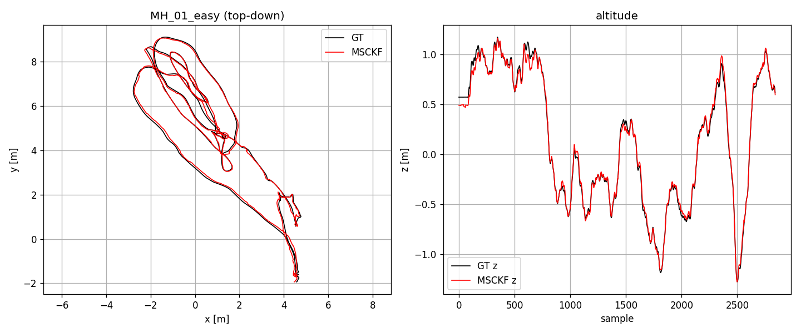
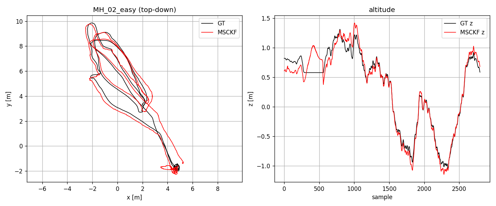
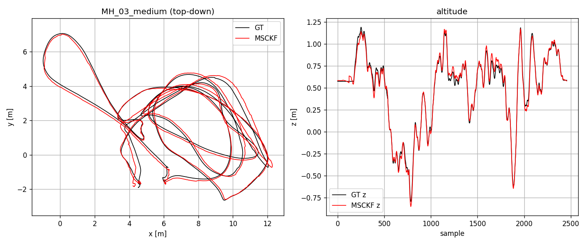
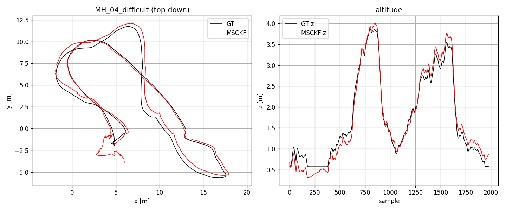
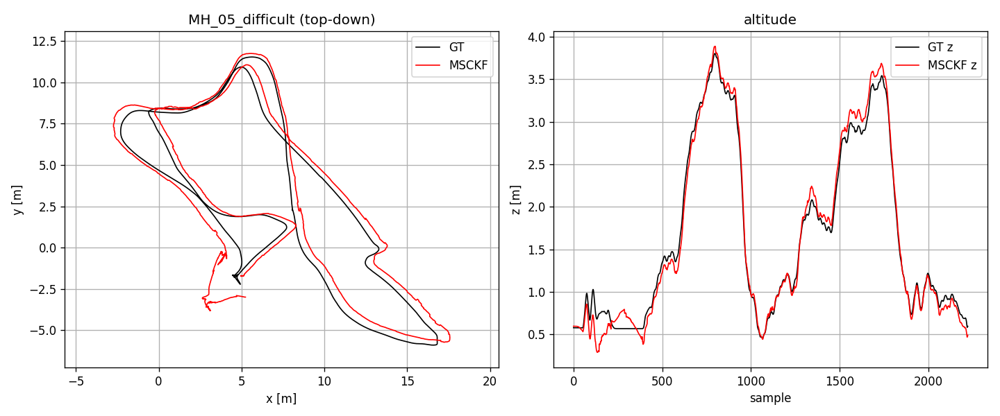

### Error plots

Following `rpg_trajectory_evaluation` (Zhang & Scaramuzza, IROS'18). Six
figures are emitted per sequence by `Code/Phase 1/plot_errors.py` under
`Results/Phase1/<seq>_plots/`:

- **Fig 1 — Translation error.** `(est_aligned − gt)` decomposed into
  x/y/z in millimetres, plotted vs cumulative distance along the GT
  trajectory. Shows where drift accumulates.
- **Fig 2 — Rotation error.** `R_err = R_gt.T · R_est_aligned`, decomposed
  into yaw/pitch/roll (ZYX intrinsic, degrees) vs distance.
- **Fig 3 — Relative translation error.** Boxplot at 5 sub-trajectory
  lengths (10/20/30/40/50% of total length). For each start index `i`, we
  pick `j` as the first index with `d(i, j) ≥ target`, compute the
  relative-pose error `T_err = (T_gt_i⁻¹ T_gt_j)⁻¹ (T_est_i⁻¹ T_est_j)`,
  and box-plot `‖T_err.t‖`.
- **Fig 4 — Relative yaw error.** Same pair-sampling, plotting
  `|yaw(R_err)|` in degrees.
- **Fig 5 — Trajectory (side view).** x vs z. Estimate blue, GT pink.
- **Fig 6 — Trajectory (top view).** x vs y. Estimate blue, GT pink.

MH_01_easy:

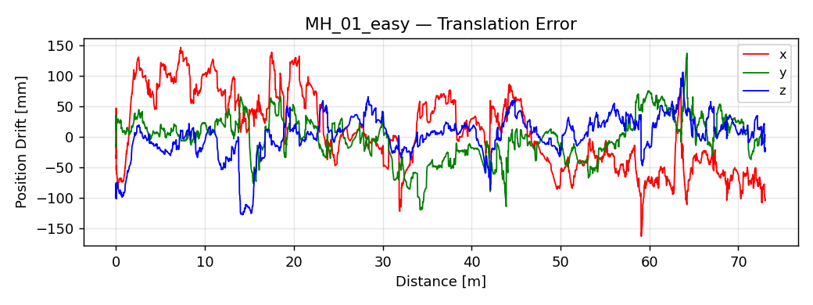
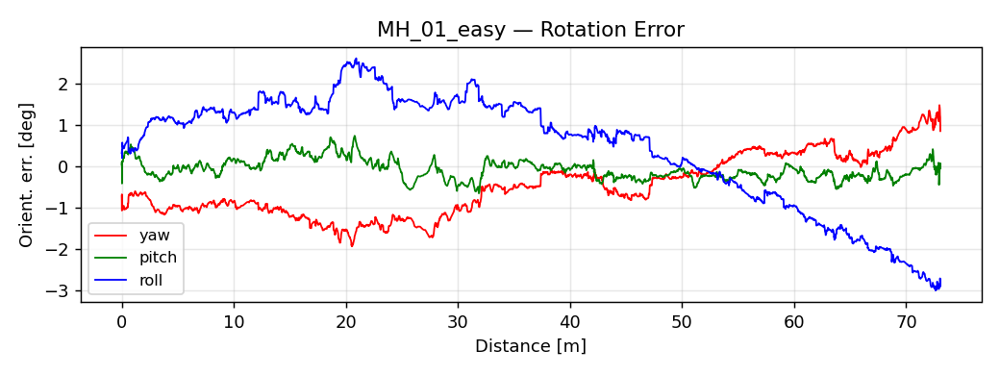
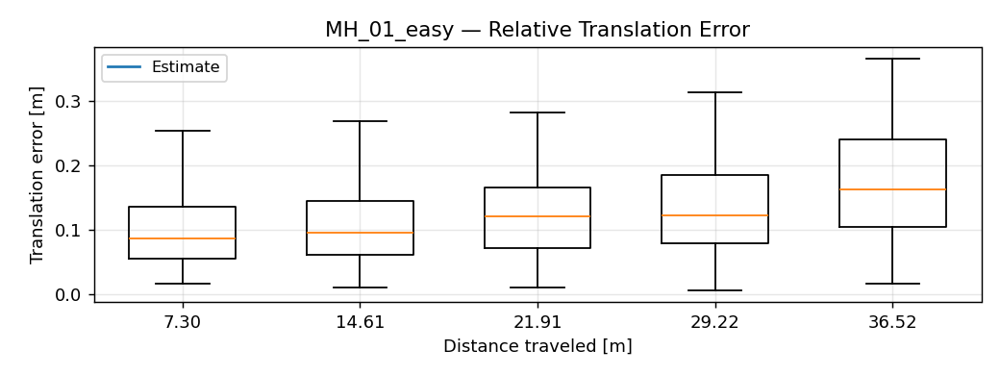
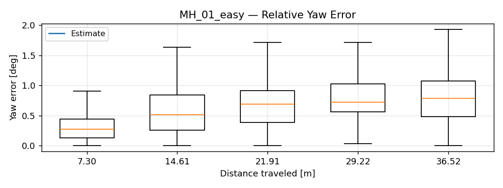
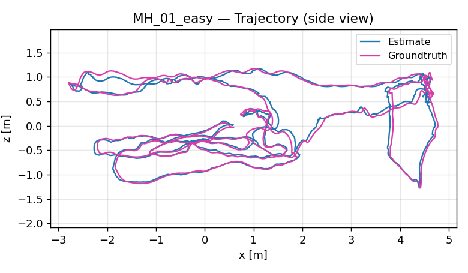
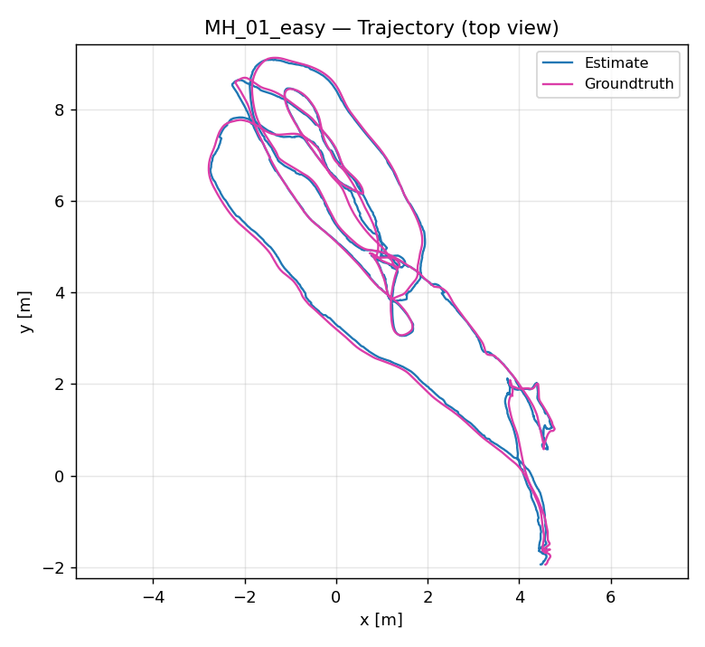

Plots for the other sequences live under `Results/Phase1/MH_02_easy_plots/`,
`Results/Phase1/MH_03_medium_plots/`, `Results/Phase1/MH_04_difficult_plots/`,
`Results/Phase1/MH_05_difficult_plots/`.

### Live visualisation (`Output.mp4`)

A single-window live viewer shows the estimate growing against the Vicon
ground truth in real time. GT is brought into the filter frame via the
same Umeyama SE(3) alignment used for ATE, so the two trajectories overlay
directly. Rendered with OpenCV only — no pangolin / matplotlib dependency.

Panels:
- **Left**: top-down X–Y trajectory — ground truth in **pink**, MSCKF estimate
  in **black**, current pose a **blue** square. 1 m scale bar bottom-left.
- **Right**: live `cam0` frame.
- **Bottom**: pose count and elapsed seconds.

```
cd "Code/Phase 1" && python3 vio.py --view --ratio 1.0 --offset 40 \
    --path /path/to/MH_01_easy \
    --est  ../../Results/Phase1/MH_01_easy_est.csv \
    --gt   /path/to/MH_01_easy/mav0/state_groundtruth_estimate0/data.csv
```

`--est` is any prior baseline run dumped by `run_eval.py`; it only supplies
the points used to fit the GT→filter Umeyama transform. `--ratio 1.0` is
real-time; lower values slow playback. Press `q` or `Esc` to quit.

The screen recording of this viewer on `MH_01_easy` is saved as `Output.mp4`
in the repo root.

## Repo layout

- `Code/Phase 1/` — active Python implementation (see [Code layout](#code-layout) for per-file roles).
- `Code/Phase 1/Misc/` — archived / unused files (`msckf_an.py`, `viewer.py`).
- `msckf_vio-master/` — authors' C++, used as the line-by-line reference.
- `1712.00036v3.pdf`, `ICRA07-MSCKF.pdf` — the two papers.
- `Data/machine_hall/` — EuRoC ASL-format sequences (extracted).
- `Results/Phase1/` — generated est trajectories, trajectory PNGs, error plots
  (one `<seq>_plots/` directory per sequence), and `summary.json`.
- `Output.mp4` — rendered by `Code/Phase 1/make_video.py`, placed at repo root.

Unit tests for the quaternion / rotation utilities:

```
cd "Code/Phase 1/test" && python3 utils_test.py
```
